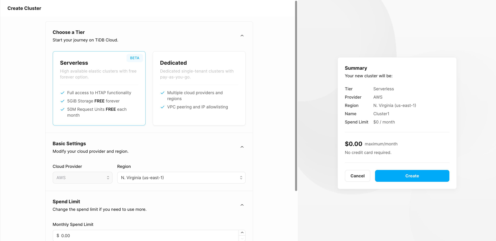
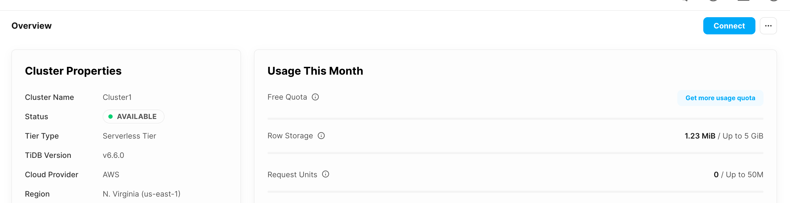
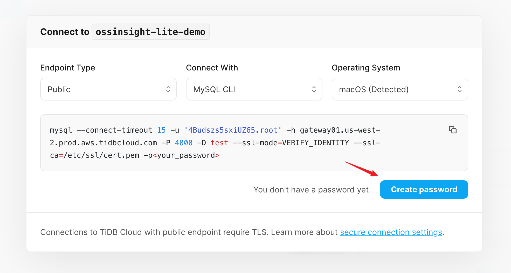
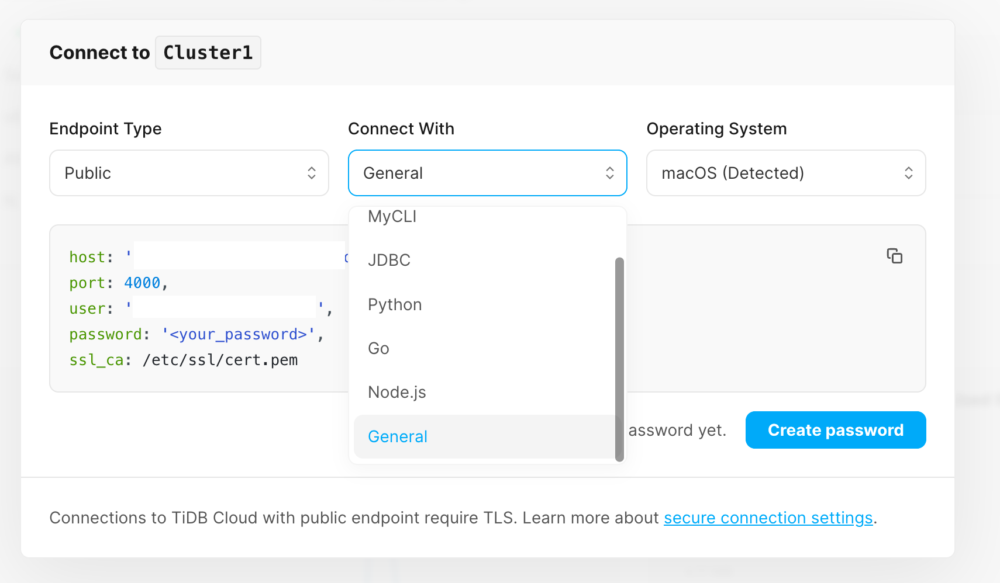

# Create TiDB Serverless cluster

1. Click [here](https://tidbcloud.com/console/clusters/create-cluster?utm_source=ossinsight&utm_medium=lite) to create a TiDB Cloud Serverless cluster.

   

      
      
<i>Create TiDB Serverless cluster page</i>

   

2. When the cluster creation is complete (about a few seconds), click the **Connect** button in the upper right corner to open the **Connect to** dialog.

   

      
      
<i>The details page of TiDB serverless cluster</i>

   

3. Click **Create password** button to create password for root user.

   > **Attention:**
   > The password cannot be displayed next time for safety, please save it in a safe place.

   

      
      
<i>Create password for TiDB Serverless cluster</i>

   

4. Select `General` in the **Connect With** drop-down list, and then COPY the connection information of TiDB Serverless.

   > The connection information of TiDB serverless cluster will be used in [next step](repo-and-action.md).

   

      
      
<i>Create password for TiDB Serverless cluster</i>

   

---

Next step: [2. Setup GitHub Action](repo-and-action.md)
