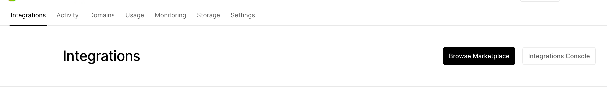
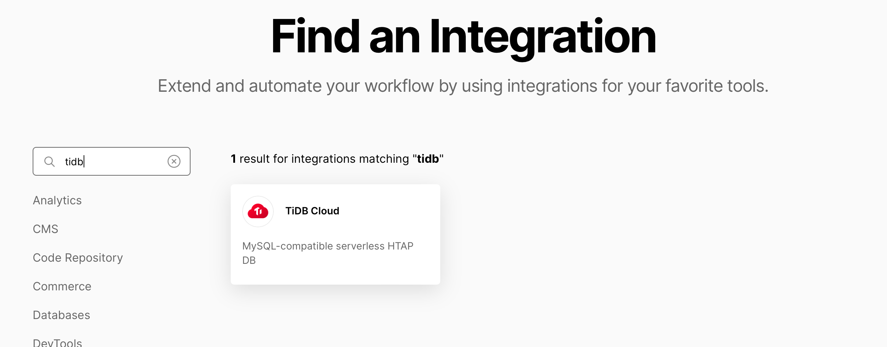
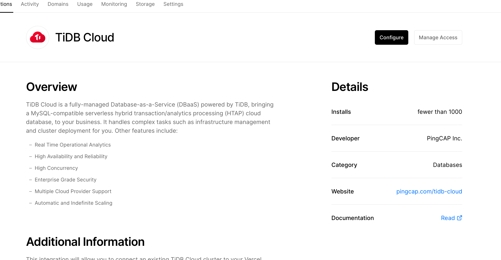
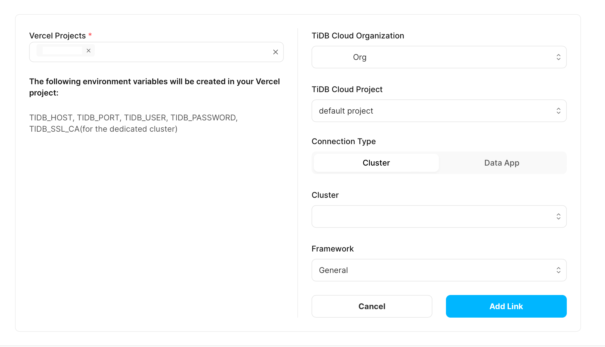

# Deploy to Vercel

## Deploy your project and assign a domain

Click `Add New...` / `Project` on the right top corner of the [Vercel dashboard page](https://vercel.com/dashboard).

Select your repo and click `Deploy`. Wait about 2 minutes and you will see:

Click `Add domain` at right side and assign a domain you want. (xxxx.vercel.app).

## Link TiDB Serverless to Vercel project

- Click `Integrations` / `Browse Marketplace`.

  

- Search `tidb`, click `TiDB Cloud` then click `Add Integration`.

  

  

- Click `Configure` and `Add Link` in TiDB Cloud page, select your repo and the cluster you've created before.

  

- Click `Add link` again then you will see the Database is linked to Vercel.

  

- Go to Vercel project `Deployment` tab and redeploy your project.

  

