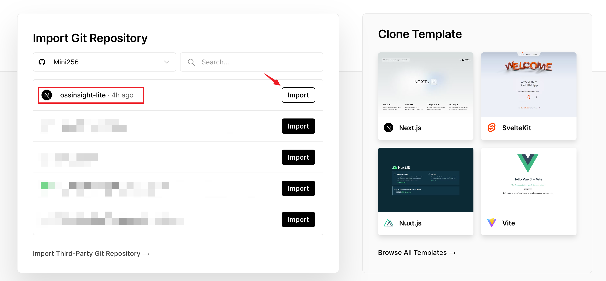
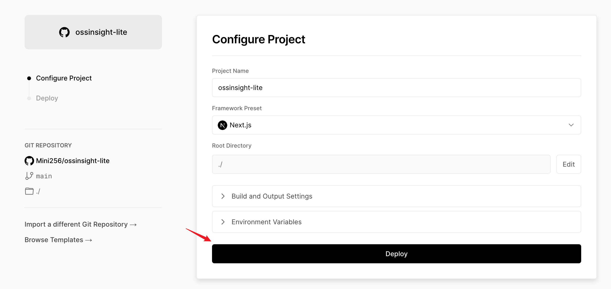
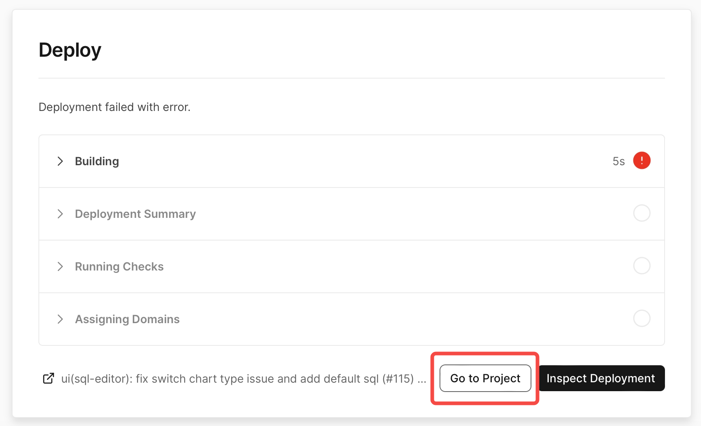
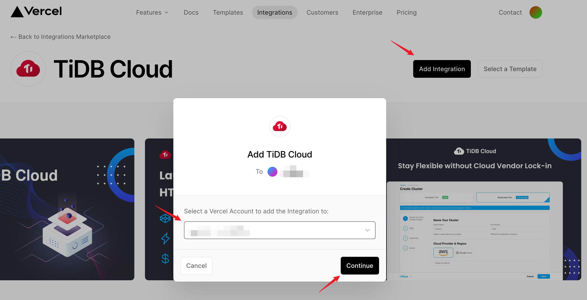
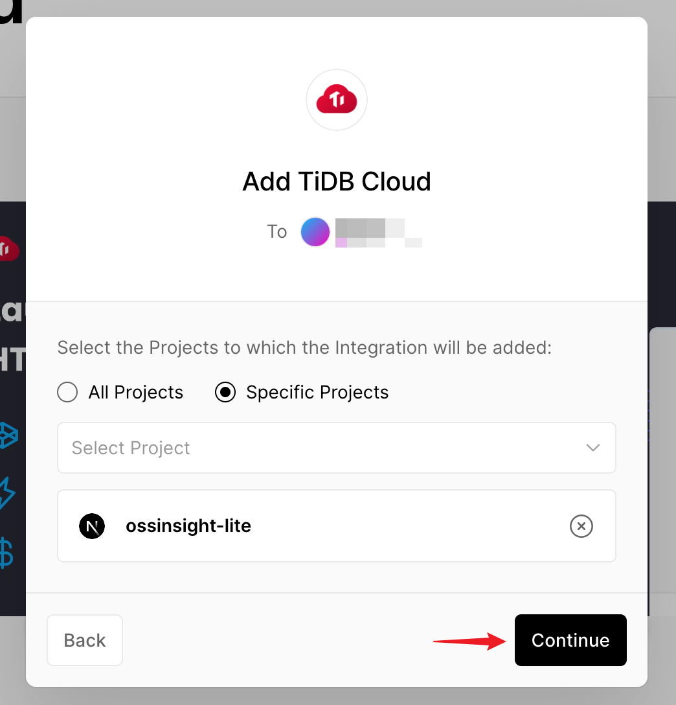
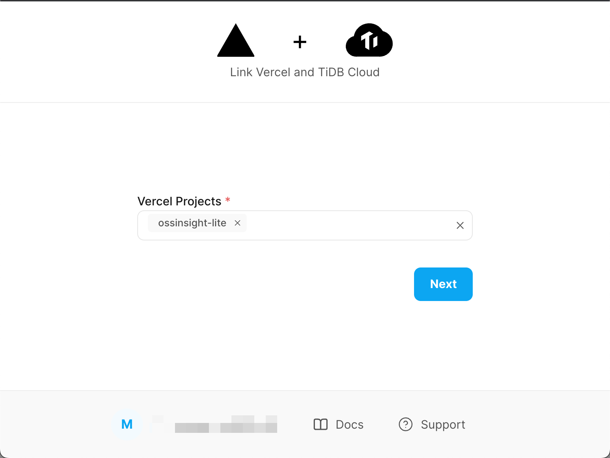
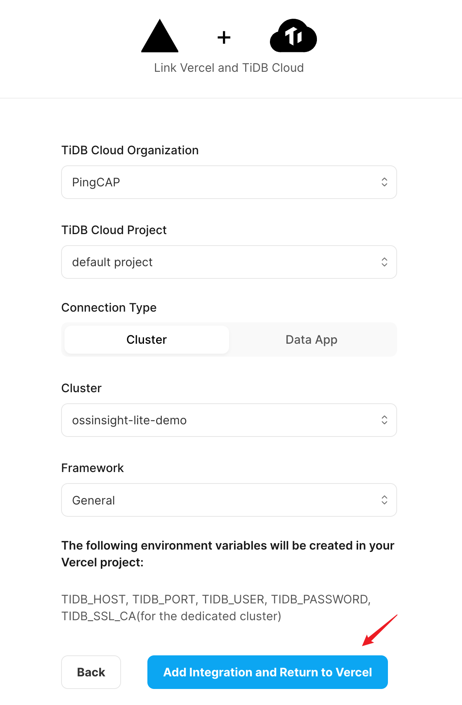
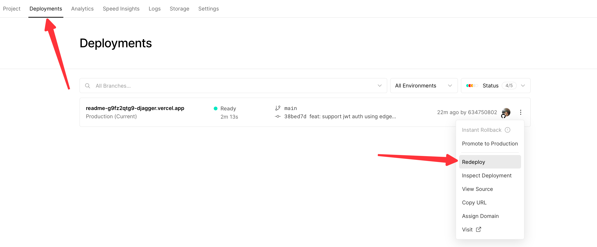

# Deploy to Vercel

## Create a Vercel project for your forked repository

1. Click **Add New...** button and select the **Project** option on the right top corner of the [Vercel dashboard page](https://vercel.com/dashboard).

   

      
      
<i>Add new project on Vercel</i>

   

2. Select your forked `ossinsight-lite` repository and click the **Import** button. 

   

      
      
<i>Import the forked repository to Vercel project</i>

   

3. Click the **Deploy** button to deploy the forked `ossinsight-lite` to Vercel (It should **fail** in seconds, but don't worry).

   

      
      
<i>Configure Vercel project</i>

   

   

      
      
<i>Click <b>go to project</b> button</i>

   

   Your vercel project was created, but we need to add TiDB Cloud Integration to make it run!

## Integrate TiDB Serverless into Vercel project

1. Go to [TiDB Cloud Integration](https://vercel.com/integrations/tidb-cloud) page on Vercel, and click the **Add Integration** button.

2. Select the Vercel Account to add TiDB Cloud Integration to, and then click **Continue** button.

   

      
      
<i>Add TiDB Cloud integration to specify Vercel account</i>

   

3. Select the Vercel project you've created before, and then click **Continue** button.

   

      
      
<i>Add TiDB Cloud integration to specify Vercel project</i>

   

   After clicking continue, the browser will open a new window, which is the integration page of TiDB Cloud.

4. Confirm the Vercel project and the TiDB Serverless cluster will be linked.

   If there is no problem, click the **Next** button to continue.

   

      
      
<i>New TiDB Cloud integration page</i>

   

   If there is no problem, click the **Add Integration and Return to Vercel** button to finish the integration.

   

      
      
<i>Configure TiDB Cloud integration page</i>

   

   > The TiDB Cloud integration with Vercel will automatically pass the database cluster connection information to the Vercel project through environment variables.

5. Go to **Deployments** tab of the Vercel project and click the **Redeploy** button to redeploy your project, so that the environment variables can take effect.

   

      
      
<i>Redeploy Vercel project</i>

   

---

Previous step: [2. Setup GitHub Action](repo-and-action.md) 
