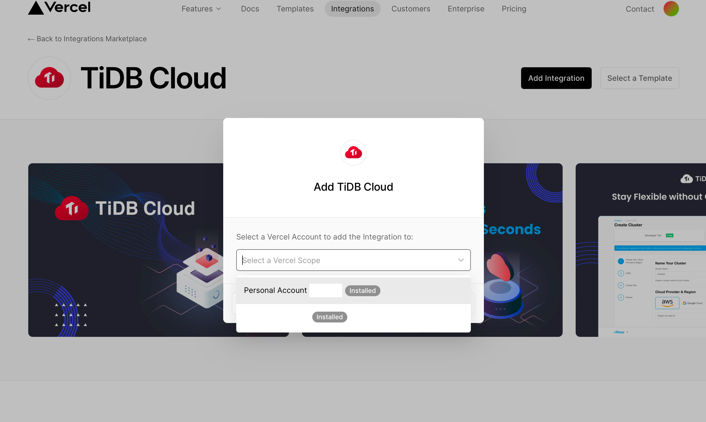
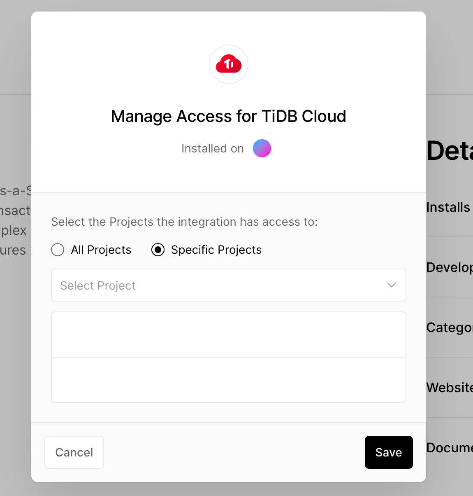

# Deploy to Vercel

- [Deploy your project and assign a domain](#deploy-your-project-and-assign-a-domain)
- [Link TiDB Serverless to Vercel project](#link-tidb-serverless-to-vercel-project)

## Deploy your project and assign a domain

Click `Add New...` / `Project` on the right top corner of the [Vercel dashboard page](https://vercel.com/dashboard).

Select your repo and click `Deploy`. Wait about 2 minutes and you will see:

Click `Add domain` at right side and assign a domain you want. (xxxx.vercel.app).

## Link TiDB Serverless to Vercel project

1. Go back to Vercel homepage, click `Integrations` / `Browse Marketplace`.

   

2. Search `tidb`, click `TiDB Cloud` then click `Add Integration`.

   

   

   

   Select your deploying account, then you will see the TiDB Cloud integration page

   

    1. Click `Manage Access` button, make sure your repository is accessible to Vercel.

       

    2. Click `Configure` in previous page, and `Add Link` button on the jumped page select your repo and the cluster
       you've created before.

       Click `Add link` again then you will see the Database is linked to Vercel.

       

3. Go to Vercel project `Deployment` tab and redeploy your project.

   

---

Last step: [2. Setup GitHub Action](repo-and-action.md) 