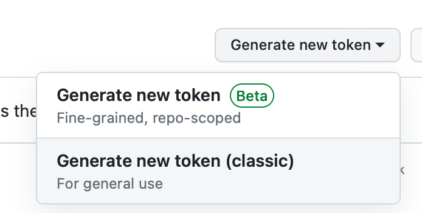
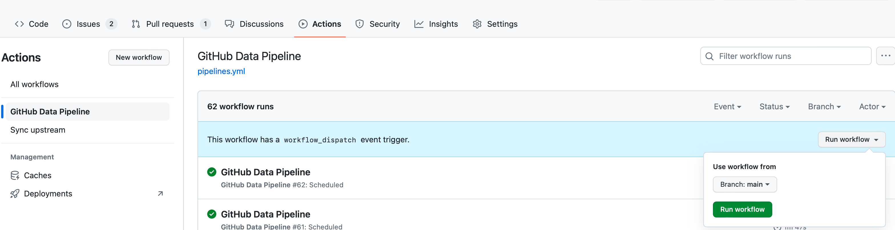

# Private data collecting

> **IMPORTANT**
>
> **Your data will not be collected by other services, and will be persisted in your own TiDB Serverless cluster. Make
> sure you have [secured your site](secure-your-site.md) if you want this feature.**

By default, OSSInsight lite uses a default GitHub Access Token
(aka [github-action[bot]](https://github.com/orgs/community/discussions/25863)) to fetch your data. This bot has no
permission to your private repos or protected organization repos. To enable data pipeline to fetch your private data,
you need some extra steps to fetch data and secure your site.

Steps:

- [**Secure your site**](secure-your-site.md)
- [Generate GitHub Access Token](#generate-github-access-token)
- [Setup GitHub Action Secret](#setup-github-action-secret)
- [Restart pipeline](#restart-pipeline)

## Generate GitHub Access Token

> Personal Access Token will have access to your private repository, **do not share it to anyone**.

You need to generate a GitHub Access Token with permissions.
Goto [GitHub Personal Token management page](https://github.com/settings/tokens), and create a classic token

It's recommended to set `Expiration` to `No expiration` to prevent regularly manual updating. No extra permissions is
needed to collect only personal private repository.

## Setup GitHub Action Secret

- Goto `Settings` / `Secrets and variables` / `Actions` page of your forked repository.
- Click `New repository secret` button at right top of the page
- Set `ACCESS_TOKEN` to your generated token above.

## Restart pipeline

Once your `ACCESS_TOKEN` correctly set, your pipeline will have read permission to your private repositories at next
run.

You could manually trigger workflow at `Actions` / `GitHub Data Pipeline` instead of waiting scheduled run.

After the pipeline is done, your private repository data should be accessible on your site.
