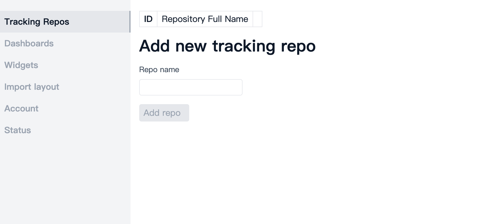
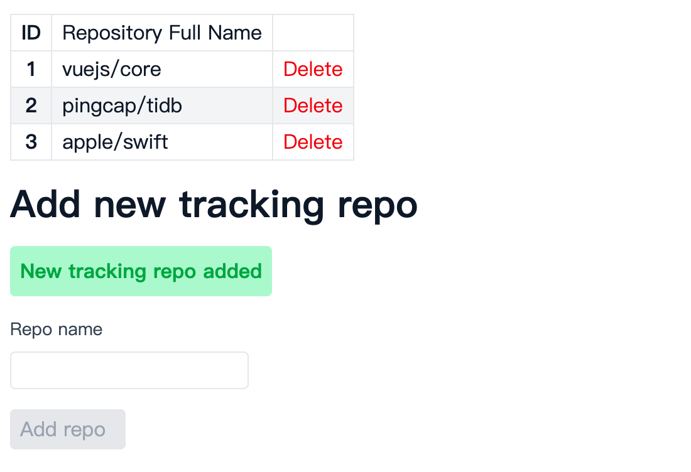

# Tracking repos setup

Ensure you have [enabled the workflow](./repo-and-action.md#enable-and-run-workflow).

## Add tracking repos in admin page

Go to your personal site and click the gear icon at left bottom corner.

Go to `Traking Repos` page

Add a repo name you want and click `Add repo` (e.g. pingcap/tidb).

## Start workflow

Once you have added tracking repos, data pipeline will auto collect the tracking repos' data
during next run. You can also manually trigger the workflow in your action page.

Usually a famous repository will take very long time at first run.
