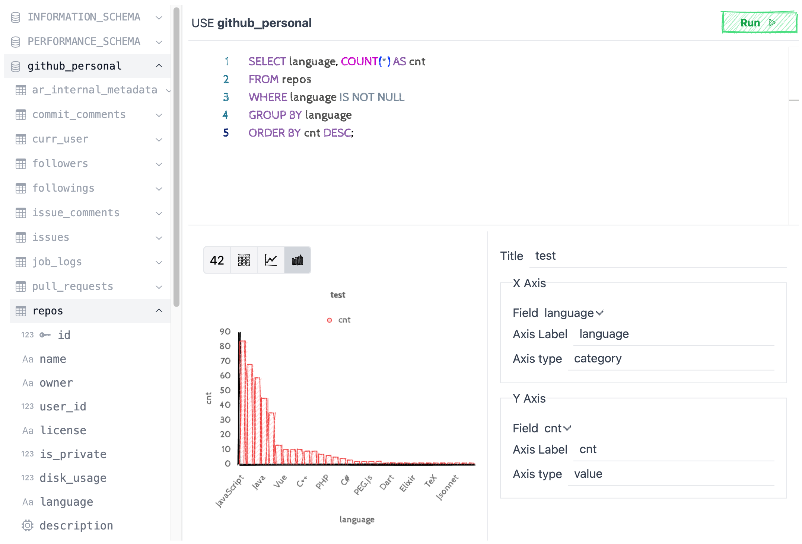

# 👋 Hello OSSInsight Lite!
Welcome to OSSInsight Lite - your customizable GitHub dashboard for visualizing your personal GitHub activity data and tracking your favorite repositories.

## 🚀  Getting Started
Hey there! Are you ready to start building your own GitHub Dashboard?

First of all, please click the “🔒” button in the top right corner, and enter the password (default is tidbcloud) to unlock the editing mode of the dashboard.

## 🧩 Add widgets from library

1. Click on the "➕" button on the top-right corner of dashboard and select Browse library to open the widget library.
2. Click on the widget you like to add it to the dashboard.
3. Resize the widget and drag it into place.
4. Click the "🎨" or "✏️" button in the top-right corner of the widget for further customing.

## 🎨 Add custom SQL widget

In the previous steps, we stored our personal GitHub data in a TiDB Serverless database via pipeline, and now you can do some interesting queries via SQL and present the results in a nice chart 📊.

Suppose you want to know "the programming language you use most", you can:

1. Click on the "➕" button in the top-right corner and select **SQL Chart** to open the SQL widget editor.
2. Type the following SQL into the SQL editor and click the Run button to verify.

    ```sql
   SELECT language, COUNT(*) AS cnt
   FROM repos
   WHERE language IS NOT NULL
   GROUP BY language
   ORDER BY cnt DESC;
   ```

3. Click the "📊" button to use the bar chart for data visualizing.

   

4. Click on the area outside the dialog box to finish editing.
5. Take advantage of your SQL skills to add more widgets you want.

## 🤝 Share with friends

1. 📋 **Share your awesome dashboard**: Copy URL of the dashboard and share it to your social platform like Twitter, Facebook etc.
2. 🔗 **Share the individual widget**: Click the share button in the top-right corner of widget to get the share link.
3. 📥 **Share the layout of dashboard**: Click the download button on bottom-right corner to download the `template.json`.

## 👣 Track repos that interest you

1. Click the "⚙️" button in the bottom-left corner to enter the management page, and then switch to the **Tracking Repos** tab.
2. Enter the name of the repository you want to track in the **Repo name** input box, for example: pingcap/tidb
3. Click the **Add repo** button to finish adding new tracking repo for pipeline.